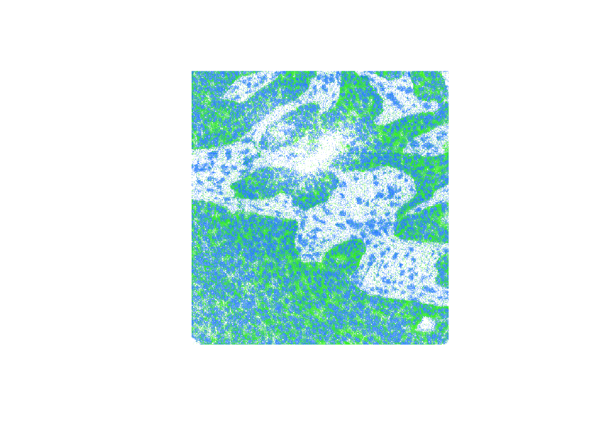

# Working with \*\*remote\*\* Zarr arrays in R

``` r

library(Rarr)
```

It is recommended you read the [general introduction “Working with Zarr
arrays in
R”](https://huber-group-embl.github.io/Rarr/articles/Rarr.html) before
reading this vignette.

Reading files in S3 storage works in a very similar fashion to local
disk. This time the path needs to be a URL to the Zarr array. We can
again use
[`zarr_overview()`](https://huber-group-embl.github.io/Rarr/reference/zarr_overview.md)
to quickly retrieve the array metadata.

``` r

s3_address <- "https://uk1s3.embassy.ebi.ac.uk/idr/zarr/v0.4/idr0076A/10501752.zarr/0"
zarr_overview(s3_address)
```

    ## Type: Array
    ## Path: https://uk1s3.embassy.ebi.ac.uk/idr/zarr/v0.4/idr0076A/10501752.zarr/0
    ## Shape: 50 x 494 x 464
    ## Chunk Shape: 1 x 494 x 464
    ## No. of Chunks: 50 (50 x 1 x 1)
    ## Data Type: float64
    ## Endianness: little
    ## Compressor: blosc

You can also pass an S3 client to the function, which is useful if you
need to set credentials or other options for accessing the bucket. See
the section @ref(s3-client) for more details. If absent,
*[Rarr](https://bioconductor.org/packages/3.24/Rarr)* will try to find
credentials and other settings on its own, which may not always be
successful. This is equivalent to the previous code block:

``` r

s3_address <- "https://uk1s3.embassy.ebi.ac.uk/idr/zarr/v0.4/idr0076A/10501752.zarr/0"
s3_client <- paws.storage::s3(
  config = list(
    credentials = list(anonymous = TRUE),
    region = "auto",
    endpoint = "https://uk1s3.embassy.ebi.ac.uk"
  )
)
zarr_overview(s3_address, s3_client = s3_client)
```

    ## Type: Array
    ## Path: https://uk1s3.embassy.ebi.ac.uk/idr/zarr/v0.4/idr0076A/10501752.zarr/0
    ## Shape: 50 x 494 x 464
    ## Chunk Shape: 1 x 494 x 464
    ## No. of Chunks: 50 (50 x 1 x 1)
    ## Data Type: float64
    ## Endianness: little
    ## Compressor: blosc

The output above indicates that the array is stored in 50 chunks, each
containing a slice of the overall data. In the example below we use the
`index` argument to extract the first and tenth slices from the array.
Choosing to read only 2 of the 50 slices is much faster than if we opted
to download the entire array before accessing the data.

``` r

z2 <- read_zarr_array(
  s3_address,
  index = list(c(1, 10), NULL, NULL)
)
```

We then plot our two slices on top of one another using the
[`image()`](https://rdrr.io/r/graphics/image.html) function.

``` r

## plot the first slice in blue
image(
  log2(z2[1, , ]),
  col = hsv(h = 0.6, v = 1, s = 1, alpha = 0:100 / 100),
  asp = dim(z2)[2] / dim(z2)[3],
  axes = FALSE
)
## overlay the tenth slice in green
image(
  log2(z2[2, , ]),
  col = hsv(h = 0.3, v = 1, s = 1, alpha = 0:100 / 100),
  asp = dim(z2)[2] / dim(z2)[3],
  axes = FALSE,
  add = TRUE
)
```



plot of chunk plot-raster

**Note:** if you receive the error message
`"Error in stop(aws_error(request$error)) : bad error message"` it is
likely you have some AWS credentials available in to your R session,
which are being inappropriately used to access this public bucket.
Please see the section @ref(s3-client) for details on how to set
credentials for a specific request.

## Using credentials to access S3 buckets

If you’re accessing data in a private S3 bucket, you can set the
environment variables `AWS_ACCESS_KEY_ID` and `AWS_SECRET_ACCESS_KEY` to
store your credentials. For example, lets try reading a file in a
private S3 bucket:

``` r

zarr_overview("https://s3.embl.de/rarr-testing/bzip2.zarr")
```

    ## Error:
    ## ! AccessDenied (HTTP 403). Access Denied.

We can see the “Access Denied” message in our output, indicating that we
don’t have permission to access this resource as an anonymous user.
However, if we use the key pair below, which gives read-only access to
the objects in the `rarr-testing` bucket, we’re now able to interrogate
the files with functions in *Rarr*.

``` r

Sys.setenv(
  "AWS_ACCESS_KEY_ID" = "bYUBYVg1AsEreuDgtg5K",
  "AWS_SECRET_ACCESS_KEY" = "r8FrLXc9dseD6V1P3htsu7ZBzP7Gszsd3sM1G4KX"
)
zarr_overview("https://s3.embl.de/rarr-testing/bzip2.zarr")
```

    ## Type: Array
    ## Path: https://s3.embl.de/rarr-testing/bzip2.zarr
    ## Shape: 20 x 10
    ## Chunk Shape: 10 x 10
    ## No. of Chunks: 2 (2 x 1)
    ## Data Type: int32
    ## Endianness: little
    ## Compressor: bz2

Behind the scenes **Rarr** makes use of the **paws** suite of packages
(<https://paws-r.github.io/>) to interact with S3 storage. A
comprehensive overview of the multiple ways credentials can be set and
used by **paws** can be found at
<https://github.com/paws-r/paws/blob/main/docs/credentials.md>. If
setting environment variables as above doesn’t work or is inappropriate
for your use case please refer to that document for other options.

## Creating an S3 client

Although **Rarr** will try its best to find appropriate credentials and
settings to access a bucket, it is not always successful. Once such
example is when you have AWS credentials set somewhere and you try to
access a public bucket. We can see an example of this below, where we
access the same public bucket used in @ref(read-s3), but it now fails
because we have set the `AWS_ACCESS_KEY_ID` environment variable in the
previous section.

``` r

s3_address <- "https://uk1s3.embassy.ebi.ac.uk/idr/zarr/v0.4/idr0076A/10501752.zarr/0"
zarr_overview(s3_address)
```

    ## 

You might encounter similar problems if you’re trying to access multiple
buckets each of which require different credentials. The solution here
is to create an “s3_client” using
[`paws.storage::s3()`](https://paws-r.r-universe.dev/paws.storage/reference/s3.html),
which contains all the required details for accessing a particular
bucket. Doing so will prevent **Rarr** from trying to determine things
on its own, and gives you complete control over the settings used to
communicate with the S3 bucket. Here’s an example that will let us
access the failing bucket by creating a client with anonymous
credentials.

``` r

s3_client <- paws.storage::s3(
  config = list(
    credentials = list(anonymous = TRUE),
    region = "auto",
    endpoint = "https://uk1s3.embassy.ebi.ac.uk"
  )
)
```

If you’re accessing a public bucket, the most important step is to
provide a `credentials` list with `anonymous = TRUE`. Doing so ensures
that no attempts to find other credentials are made, and prevents the
problems seen above. If you’re using files on Amazon AWS storage you’ll
need to set the `region` to whatever is appropriate for your data
e.g. `"us-east-2"`, `"eu-west-3"`, etc. For other S3 providers that
don’t have regions use the value `"auto"` as in the example below.
Finally the `endpoint` argument is the full hostname of the server where
your files can be found. For more information on creating an S3 client
see the [**paws.storage**
documentation](https://paws-r.github.io/docs/s3/).

We can then pass our s3_client to
[`zarr_overview()`](https://huber-group-embl.github.io/Rarr/reference/zarr_overview.md)
and it now works successfully.

``` r

zarr_overview(s3_address, s3_client = s3_client)
```

    ## Type: Array
    ## Path: https://uk1s3.embassy.ebi.ac.uk/idr/zarr/v0.4/idr0076A/10501752.zarr/0
    ## Shape: 50 x 494 x 464
    ## Chunk Shape: 1 x 494 x 464
    ## No. of Chunks: 50 (50 x 1 x 1)
    ## Data Type: float64
    ## Endianness: little
    ## Compressor: blosc

Most functions in **Rarr** have the `s3_client` argument and it can be
applied in the same way.
